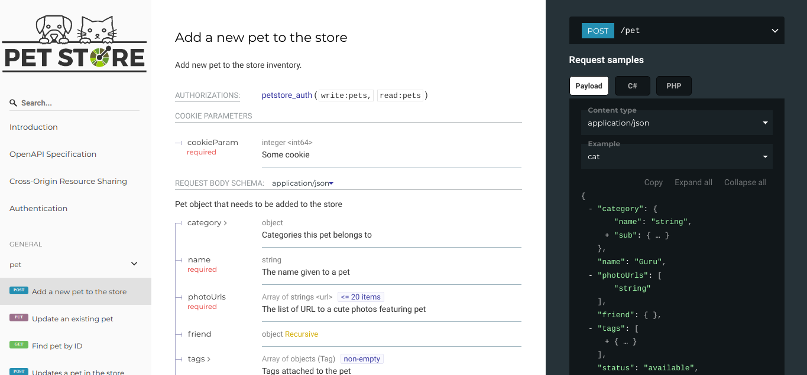

<h1 align="center">
  NestJS-Redoc
  <h4 align="center">ReDoc powered frontend for your NestJS API spec</h4>
</h1>

<div align="center">
  <a href="http://makeapullrequest.com">
    
  </a>
  <a href="https://github.com/nestjs/nest">
    
  </a>
   <a href="https://opensource.org/licenses/MIT"></a>
</div>

<div align="center">

[⚡ Features](#-Features) | 
[🗿 Installation](#-Installation) |
[❓ How to use](#-How-to-use) |
[👨‍💻👩‍💻 Contributors](#--Contributors) |
[📜 Changelog](#-Changelog) |
[📋 ToDo](#-ToDo)

</div>



<p align="center">

📒 This is a [ReDoc](https://github.com/Redocly/redoc) powered frontend for your NestJS API spec.

</p>

## ⚡ Features

* Customizable theme
* It's almost a drop in replacement for you current swagger UI, you only need to import this package and modify any settings you may want to change (e.g: Page title, ReDoc options)

## 🗿 Installation

Using npm: ```npm i nestjs-redoc```

Using yarn: ```yarn add nestjs-redoc```

## ❓ How to use

You need to install the [Swagger Module](https://github.com/nestjs/swagger) first if you want to get definitions updated with your project.

In future versions you will be able to pass a URL parameter as document, but for the moment you need this document object from the swagger module

```typescript
const options = new DocumentBuilder()
  .setTitle('Look, i have a title')
  .setDescription('A very nice description')
  .setBasePath('/api/v1')
  .build();
const document = SwaggerModule.createDocument(app, options);
```

Then add the following example code.

**Note**: All properties are optional, if you don't specify a title we will fallback to the one you used above.

```typescript
const redocOptions: RedocOptions = {
  title: 'Hello Nest',
  logo: {
    url: 'https://redocly.github.io/redoc/petstore-logo.png',
    backgroundColor: '#F0F0F0',
    altText: 'PetStore logo'
  },
  sortPropsAlphabetically: true,
  hideDownloadButton: false,
  hideHostname: false
};
// Instead of using SwaggerModule.setup() you call this module
await RedocModule.setup('/docs', app, document, redocOptions);
```

## Available options

### Redoc Options

| Option                  | Description                                                                                                                                           | Type         | Note                                       |
| ----------------------- | ----------------------------------------------------------------------------------------------------------------------------------------------------- | ------------ | ------------------------------------------ |
| title                   | Web site title (e.g: ReDoc documentation)                                                                                                             | string       | Fallbacks to the document title if not set |
| logo                    | Logo Options                                                                                                                                          | LogoOptions  | See LogoOptions table                      |
| theme                   | Theme options                                                                                                                                         | ThemeOptions | See ThemeOptions info                      |
| untrustedSpec           | If set, the spec is considered untrusted and all HTML/markdown is sanitized to prevent XSS, by default is false                                       | boolean      |
| supressWarnings         | If set, warnings are not rendered at the top of documentation (they are still logged to the console)                                                  | boolean      |
| hideHostname            | If set, the protocol and hostname won't be shown in the operation definition                                                                          | boolean      |
| expandResponses         | Specify which responses to expand by default by response codes, values should be passed as comma-separated list without spaces (e.g: 200, 201, "all") | string       |
| requiredPropsFirst      | If set, show required properties first ordered in the same order as in required array                                                                 | boolean      |
| sortPropsAlphabetically | If set, propeties will be sorted alphabetically                                                                                                       | boolean      |
| showExtensions          | If set the fields starting with "x-" will be shown, can be a boolean or a string with names of extensions to display                                  | boolean      |
| noAutoAuth              | If set, redoc won't inject authentication section automatically                                                                                       | boolean      |
| pathInMiddlePanel       | If set, path link and HTTP verb will be shown in the middle panel instead of the right one                                                            | boolean      |
| hideLoading             | If set, loading spinner animation won't be shown                                                                                                      | boolean      |
| nativeScrollbars        | If set, a native scrollbar will be used instead of perfect-scroll, this can improve performance of the frontend for big specs                         | boolean      |
| hideDownloadButton      | This will hide the "Download spec" button, it only hides the button                                                                                   | boolean      |
| disableSearch           | If set, the search bar will be disabled                                                                                                               | boolean      |
| onlyRequiredInSamples   | Shows only required fileds in request samples                                                                                                         | boolean      |

**Note**: If you want to change your ReDoc theme settings, take a look at the official ReDoc documentation: https://github.com/Redocly/redoc/blob/master/src/theme.ts

Apply the properties defined in ResolvedThemeInterface to the key called "theme" in the redoc options

### Logo options

| Option          | Description                                                                           | Type   | Example  |
| --------------- | ------------------------------------------------------------------------------------- | ------ | -------- |
| url             | The URL pointing to the spec Logo, must be in the format of a URL and an absolute URL | string |
| backgroundColor | Background color to be used, must be RGB color in hexadecimal format (e.g: #008080)   | string | #F0F0F0  |
| altText         | Alt tag for Logo                                                                      | string | PetStore |
| href            | href tag for Logo, it defaults to the host used for your API spec                     | string |

## 👨‍💻👩‍💻 Contributors

Special thanks to [Jay McDoniel (jmcdo29)](https://github.com/jmcdo29) who helped with code refactoring and unit tests! 👏

## 📜 Changelog

Bellow are a list of changes, some might go undocumented

* 1.0.0 - First release
* 1.1.0 - Minor changes, nothing too important
* 1.2.0 - Added unit tests, refactored code

## 📋 ToDo

* Add unit tests (i'm still learning how to)
* Add Fastify support
* Add the option to use a spec URL instead of document
